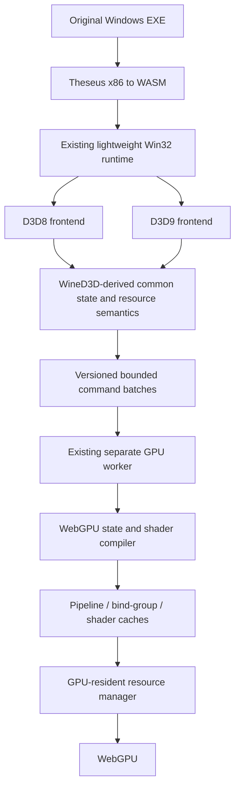

# WineD3D → WebGPU feasibility and migration decision

Date: 2026-09-09. Status: architecture decision plus completed shader-compiler pilot; a complete WineD3D compatibility core or broad game acceptance is not claimed.

**Recommendation: keep Theseus, the lightweight Win32 runtime, and the separate GPU worker. Build a new WineD3D-derived compatibility mode beside the deprecated custom D3D mode. Start with an isolated `vkd3d-shader` compiler pilot, then reuse selected state, declaration, fixed-function, and resource semantics through a common D3D8/D3D9 representation. Defer transplanting the whole WineD3D core until these smaller extractions demonstrate a benefit.**

This is a compatibility project. Reusing Wine code can reduce duplicated semantic work; it does not automatically provide Wine's game coverage or fix guest execution, audio, input latency, or presentation performance. The eventual target is broad application compatibility, with Humus and Hamsterball as acceptance programs rather than special cases in the renderer.

## Scope and evidence

The source audit uses Wine revision [`bd0f453b7bb4`](https://github.com/wine-mirror/wine/commit/bd0f453b7bb4e16c3b4ef271b3df499c34fbe848), dated 2026-09-08, including its bundled vkd3d. A separate audit of standalone vkd3d build metadata uses revision [`84a77b438f0b`](https://gitlab.winehq.org/wine/vkd3d/-/tree/84a77b438f0b7a45441db20d390a240a8580f3bc). These snapshots are distinct; do not combine their headers and implementations without checking compatibility. Source hashes and locally measured artifact sizes are in [the audit manifest](../evidence/wined3d-feasibility-audit.json).

DirectWebGPU's preserved public baseline is `2f14deb4313a38696ca3b97f35a037f561c247f0`. The original checkout also contains pending renderer experiments; they were inspected separately and were not imported into this report's development checkout. Its local Theseus checkout has additional changes outside the public patch. A build from that checkout is not automatically reproducible from the public revision.

Existing [Humus evidence](../evidence/current-render-summary.json) records a working original-executable scene and scoped camera/lighting checks. [Full acceptance remains incomplete](../evidence/acceptance-audit.json). The subsequent [`wined3d-webgpu` Humus run](../evidence/wined3d-humus-run.json) records the original executable rendering through `libvkd3d-shader`, Naga and WebGPU. Hamsterball still has reported missing/flickering textures, incorrect level rendering, slow startup and approximately 10 visibly changing frames per second despite a much higher harness rate; it has not passed this mode.

The initial investigation inspected source and build metadata. The implemented pilot now compiles standalone `libvkd3d-shader` 2.1 to WASM; estimates for a broader WineD3D core remain engineering estimates rather than measured results.

## Preserve two modes

The existing implementation is the **deprecated legacy mode**, internally named `legacy-win32`. It already uses a lightweight Win32 implementation and custom D3D translation; the name does not mean it runs full Wine. Keep its entry point, compiler artifacts, protocol decoder, rebuild inputs and evidence recoverable. Do not overwrite them while developing the new mode.

The primary development direction is **`wined3d-webgpu`**. Its current implementation is a shader-compiler milestone; swapping MojoShader for vkd3d is not sufficient to claim a complete WineD3D compatibility core.

Implement selection explicitly at launch/build time. Use separate generated-artifact directories, mode-specific dependency/build manifests and versioned protocol handlers. Preserve the current URL as a legacy alias until the new mode passes acceptance. Once it does, make the new mode the normal launch path while retaining explicit legacy selection. An unavailable or failing new mode must report its error; silently falling back would invalidate testing. A Git branch alone preserves history but does not satisfy the final requirement for two selectable modes.

New work is isolated on `codex/wined3d-webgpu`; the original checkout and its pending experiments remain intact. Commit the report first, then independently verified build, compiler, semantic and browser milestones. Keep private game files outside the repository. The public Humus demo remains the reproducible original-EXE gate.

## Where WineD3D's boundary actually lies

Wine's D3D8 and D3D9 DLLs are API frontends over WineD3D. WineD3D maintains common device/state/resource objects, emits command-stream operations, and dispatches to adapter, resource, shader and fixed-function backend interfaces. However, this is an internal abstraction boundary, not an independently packaged portable core. Its public build imports `opengl32`, `user32`, `gdi32` and `advapi32`, plus vkd3d; its Unix library links `win32u`. The build also includes GL/Vulkan and video paths irrelevant to an initial DX8/9 browser implementation. [WineD3D build](https://github.com/wine-mirror/wine/blob/bd0f453b7bb4e16c3b4ef271b3df499c34fbe848/dlls/wined3d/Makefile.in)

The useful seams are `wined3d_adapter_ops` (device/resources/views/samplers/queries, context, draw, mapping and copies), `wined3d_shader_backend_ops` (compilation, constants and draw setup), and `wined3d_resource_ops` (references, subresources, map/unmap). A WebGPU adapter would need substantially more than a draw callback. Shared resource structures retain GL-related fields, and generic operations still acquire contexts or dispatch resource-location work. [Internal interfaces and structures](https://github.com/wine-mirror/wine/blob/bd0f453b7bb4e16c3b4ef271b3df499c34fbe848/dlls/wined3d/wined3d_private.h)

| Behavior to retain | Wine source to examine/reuse | Current DirectWebGPU counterpart | Extraction assessment |
|---|---|---|---|
| D3D8/9 validation, COM ownership and API differences | `dlls/d3d8/device.c`, `dlls/d3d9/device.c` and their resource wrappers | Theseus `win32/winapi/src/d3d8.rs`, `d3d9/`; public changes in `patches/theseus.patch` | Medium/high. Retain separate frontend rules; normalize afterward. Whole COM wrappers have substantial Wine coupling. |
| State defaults, capture/apply, dirty tracking | WineD3D `stateblock.c`, common portions of `device.c` | Guest device state; `web/d3d9-state.js`; draw snapshots | Medium. Extract tables and semantic transitions together with reference rules and tests; do not copy GPU invalidation machinery wholesale. |
| FVF and vertex declarations | `vertexdeclaration.c`, D3D8 shader/declaration handling | Guest declarations; `web/vertex-layout.js` | Medium. Good early semantic module; formats, caps and shader input mapping remain dependencies. |
| Samplers, TSS, fixed function, alpha/fog/lighting | `sampler.c`, `ffp_hlsl.c`, `ffp_gl.c`, FFP parts of `glsl_shader.c`, state/settings generation | `web/d3d9-samplers.js`, `web/fixed-function.js`, `web/d3d9-pipelines.js` | Medium/high. HLSL generation is promising, but its settings, constants and device flags need a controlled adapter. GL-specific emitters are not a portable core. |
| Resource lifetime, pools, dirty data, locks | `resource.c`, `buffer.c`, `texture.c`, `surface.c`; corresponding frontend wrappers | Guest resources; `web/gpu-buffers.js`, `web/gpu-textures.js` | High for whole files. Reuse behavioral rules incrementally; replace backend location/copy/fence machinery. |
| Formats, depth/stencil, blending and capabilities | `utils.c`, state/device code, `directx.c`, backend state tables | `web/d3d9-caps.js`, `d3d9-state.js`, textures and pipelines | Medium for format facts; high for complete capability and emulation behavior. Advertise only features the WebGPU path implements. |
| Reset/lost-device, presentation and queries | D3D8/9 device wrappers; WineD3D `device.c`, `swapchain.c`, `query.c` | Guest device and GPU worker lifecycle | High. Windows display ownership and backend synchronization must be replaced, while guest-visible API behavior is retained. |
| SM1/2/3 parsing and lowering | vkd3d `d3dbc.c`, `ir.c`, `spirv.c`, public compiler/scan API; WineD3D `shader_spirv.c` | MojoShader C bridge → SPIR-V → Naga in `runtime/shaders`; `web/shaders.js` | Best bounded direct-reuse pilot. The browser binding/reflection and shader ABI still require work. |
| Queueing and submission | WineD3D `cs.c`, adapter/context implementations | `web/worker.js`, `web/draw-batch.js`, `web/gpu-worker.js`, draw renderer | Keep DirectWebGPU ownership. Do not import a second opaque native command thread or translate OpenGL calls. |

These are candidate extractions, not claims that each file compiles independently. The [audited source manifest](../evidence/wined3d-feasibility-audit.json) links every inspected file.

API differences are substantive: D3D8's texture-stage setter maps some states to sampler state, whereas D3D9 has separate sampler APIs; D3D8 also has shader/declaration handle behavior that is not just a renamed D3D9 interface. Preserve return values, defaults and reference semantics in the frontends. [D3D8 state mapping](https://github.com/wine-mirror/wine/blob/bd0f453b7bb4e16c3b4ef271b3df499c34fbe848/dlls/d3d8/device.c#L2335), [D3D9 state mapping](https://github.com/wine-mirror/wine/blob/bd0f453b7bb4e16c3b4ef271b3df499c34fbe848/dlls/d3d9/device.c#L2858)

### Portability work that cannot be avoided

Replace WineD3D initialization and registry configuration with explicit configuration/caps inputs. Its startup reads Wine-specific registry options, and display/device discovery calls Windows graphics/display services. Browser canvas dimensions and adapter limits must supply that information without fabricating support. Do not import the Wine loader, wineserver, registry, desktop window management, Unix process layer or full Win32 runtime. [Initialization](https://github.com/wine-mirror/wine/blob/bd0f453b7bb4e16c3b4ef271b3df499c34fbe848/dlls/wined3d/wined3d_main.c), [adapter/display discovery](https://github.com/wine-mirror/wine/blob/bd0f453b7bb4e16c3b4ef271b3df499c34fbe848/dlls/wined3d/directx.c)

WineD3D has a single-threaded command-stream implementation as well as its native threaded path. Disabling the threaded path is a useful starting point for a stripped core, but does not remove all platform dependencies. The threaded path uses Windows events, NT waits, module lifetime and thread/TEB services. In the browser, use the existing CPU/GPU worker protocol and explicit completion IDs. [Command-stream construction](https://github.com/wine-mirror/wine/blob/bd0f453b7bb4e16c3b4ef271b3df499c34fbe848/dlls/wined3d/cs.c#L3618)

For a C core, inventory unresolved imports after each link: allocator/libc/math, debug helpers, lists/trees, atomics/locks, callbacks and Windows type definitions can have small host adapters; real window/DC/display operations require architectural replacement. Stubbing them to success would produce incorrect caps and lifetime behavior. Build tools such as `widl` are not evidence that Wine must run inside the browser.

## Shader reuse: practical route and unresolved issues

DirectWebGPU already reuses a shader compiler: MojoShader handles legacy bytecode, followed by Naga for SPIR-V → WGSL. Preserve that implementation inside the legacy mode.

Wine's current `vkd3d-shader` parses legacy bytecode through `d3dbc_parse`, uses its internal VSIR representation and transforms, then emits SPIR-V. At the audited Wine revision, the **advertised legacy-bytecode targets are SPIR-V binary, D3D assembly, and conditionally SPIR-V text**. GLSL and MSL appear elsewhere in the compiler and some configurations, but are not advertised legacy-bytecode targets in this matrix. There is no advertised WGSL target. Source/target availability does not prove every opcode or game shader works. [Parser and target matrix](https://github.com/wine-mirror/wine/blob/bd0f453b7bb4e16c3b4ef271b3df499c34fbe848/libs/vkd3d/libs/vkd3d-shader/vkd3d_shader_main.c)

Standalone vkd3d builds `libvkd3d-shader` separately from its D3D12/Vulkan runtime. The shader target links common utilities, math, and optional SPIRV-Tools; common utilities can bring pthread-related support. The project-wide configure script checks additional dependencies, including Vulkan headers, even though a shader-only artifact need not load a Vulkan driver. HLSL needs generated flex/bison sources; git builds may need `widl` for generated headers. A focused Emscripten build must retain correct configuration/headers and audit actual imports. A ready-made WASM package is **not** established. [Standalone library target](https://gitlab.winehq.org/wine/vkd3d/-/blob/84a77b438f0b7a45441db20d390a240a8580f3bc/Makefile.am#L391), [configure checks](https://gitlab.winehq.org/wine/vkd3d/-/blob/84a77b438f0b7a45441db20d390a240a8580f3bc/configure.ac)

The first experiment should use the public `vkd3d_shader_compile` and scan APIs, emitting SPIR-V into the existing Naga WASM adapter. Keep VSIR internal. Its private instruction/program structures are valuable implementation machinery, not a stable serialized application protocol. WineD3D's older internal shader structures and vkd3d's VSIR are also different things. A direct VSIR → WGSL backend is feasible in principle but creates another compiler backend to maintain; attempt it only if the SPIR-V bridge has demonstrated essential blockers. [VSIR definitions](https://github.com/wine-mirror/wine/blob/bd0f453b7bb4e16c3b4ef271b3df499c34fbe848/libs/vkd3d/libs/vkd3d-shader/vkd3d_shader_private.h), [IR transforms](https://github.com/wine-mirror/wine/blob/bd0f453b7bb4e16c3b4ef271b3df499c34fbe848/libs/vkd3d/libs/vkd3d-shader/ir.c)

Naga's presence does not make arbitrary Vulkan SPIR-V acceptable to WebGPU. The pilot must handle resource binding/reflection, separate image/sampler bindings, uniform layouts, vertex semantics and inter-stage linkage, integer/boolean constants, relative addressing, control flow, derivatives, texture instructions, and pixel-center/clip conventions. Avoid applying existing Mojo-specific corrections twice. Browser shader modules consume WGSL; validate the resulting WGSL and rendered behavior. [Existing Naga adapter](../runtime/shaders/src/lib.rs), [WebGPU shader modules](https://www.w3.org/TR/webgpu/#shader-module-creation), [WGSL](https://www.w3.org/TR/WGSL/)

Fixed-function rendering requires additional work. WineD3D's `ffp_hlsl.c` generates vertex/pixel HLSL and compiles it to legacy bytecode (`vs_2_a`/`ps_2_a`) through vkd3d. The SPIR-V backend also supplies legacy parameters such as alpha-test reference and clip-plane data. This is a concrete reusable route for TSS/lighting/fog behavior, with dependencies on WineD3D settings and constant layouts. Evaluate this path before writing another comprehensive custom WGSL generator. Test all relevant stages, argument modifiers, temporary/result registers, texgen, texture transforms, material sources, lights, fog and alpha independently of a game's name. [FFP HLSL generator](https://github.com/wine-mirror/wine/blob/bd0f453b7bb4e16c3b4ef271b3df499c34fbe848/dlls/wined3d/ffp_hlsl.c), [SPIR-V backend parameters](https://github.com/wine-mirror/wine/blob/bd0f453b7bb4e16c3b4ef271b3df499c34fbe848/dlls/wined3d/shader_spirv.c)

## Five options compared

All options retain Theseus and the lightweight Win32 environment. All need a purpose-built WebGPU renderer. “Compatibility potential” means an architectural advantage, not inherited Wine support for every game.

| Option | Required Wine dependencies | Worker fit | Shader difficulty | Long-term compatibility |
|---|---|---|---|---|
| **1. Continue custom D3D** | None at runtime; current MojoShader/Naga remain | Best immediate fit; current queue already exists | Medium for current subset; high for full SM1–3/FFP behavior and browser edge cases | Full control and small runtime, but continued independent resource/state/FFP work; game coverage grows case by case |
| **2. Port selected WineD3D modules to Rust** | Selected source-derived rules/tables/algorithms; replace Wine helpers with Rust structures; optional isolated vkd3d C compiler | Good when guest state and GPU ownership are separated by the common IR | Medium/high with vkd3d reuse; very high if also translating its compiler to Rust | Best incremental balance; reuses mature behavior, but ports can diverge and require tracked upstream comparisons |
| **3. Compile stripped WineD3D core to WASM** | Common C core, Wine types/utilities, allocator/sync/config/display adapters; remove GL/Vulkan/video and DLL startup dependencies | Possible but invasive: native pointers and command-stream ownership must fit worker boundaries | Medium/high if compiler retained; FFP and WGSL integration still necessary | More behavior stays upstream-shaped, but core extraction can become a large fork with browser-specific lifetime bugs |
| **4. Add WebGPU renderer inside WineD3D** | Broad internal WineD3D interfaces plus platform surgery from option 3; WebGPU adapter/context/resources/shader backend | Difficult: keep WebGPU in GPU worker, bridge synchronous guest APIs, avoid duplicate native command threads | High: full renderer contract, caps/emulation and shader ABI integration | Greatest structural opportunity to share upstream fixes if accepted upstream; highest initial cost and no guaranteed upstream acceptance |
| **5. WineD3D as behavioral reference only** | No Wine-derived runtime code; optional externally run Wine/Windows reference tests | Excellent; implement directly in existing worker design | High: keep Mojo/Naga and independently implement missing semantics | Useful for isolated modules; still bears most compatibility implementation and maintenance cost |

### Size, memory, licensing and effort estimates

The following are **low-confidence planning ranges**, not measurements or promises. They assume optimized WASM with dead-code elimination, DX8/9 scope, no full Wine runtime, no bundled GL/Vulkan implementation, and the existing Naga retained. Size is *additional uncompressed WASM* over today's artifacts; retaining both shader compilers during migration increases download size. Memory is *additional live CPU-side state/compiler/cache memory* for a small demo, excluding guest backing, textures, GPU allocations and browser/driver overhead. Real games can exceed these ranges substantially. Effort assumes one experienced graphics/runtime engineer; overlapping work is not additive.

| Option | Added WASM estimate | Added CPU memory estimate | Licensing implications | Effort estimate |
|---|---|---|---|---|
| 1. Custom | 0–2 MiB for the next compatibility tranche | 0–16 MiB with bounded caches; can decrease by eliminating copies | Current dependency obligations; no new Wine code | 2–6 engineer-weeks for a measured tranche; 6–18+ engineer-months for a materially broader subset |
| 2. Selected Rust ports | 1–6 MiB, including an optional vkd3d compiler | 8–64 MiB including compilation peaks | Ports remain derived LGPL code; compiler separately LGPL; preserve origin/modification notices | 2–4 weeks for extraction/compiler pilot; 2–4 months for initial coherent core; 6–18+ months broadening |
| 3. Stripped C core | 4–15 MiB | 16–96 MiB; duplicated CPU shadows/queues can dominate | LGPL core/compiler and audited utility licenses; source and relinking obligations | 6–12 weeks for build/platform cut; 4–9 months initial executable integration; 12–24+ months broadening |
| 4. WebGPU in WineD3D | 6–20 MiB after aggressive platform/backend stripping | 24–128 MiB; backend state, staging and retained core allocations | LGPL fork/new linked backend assessment; same distribution obligations | 8–16 weeks for proof of backend; 6–12 months initial usable subset; 18–36+ months broadening |
| 5. Reference only | 0–3 MiB for the next compatibility tranche | 0–24 MiB with bounded caches | No Wine runtime obligations for independently written code; copied tests/code retain their licenses | 2–6 weeks for reference harness/first module; 6–18+ months broader subset, ongoing behavior discovery |

Size ranges reflect how much C/compiler/platform machinery each option retains, not source-line counts. Replace them with a release WASM build/import inventory and measured allocator high-water marks before choosing a full-core extraction. Options 3 and 4 may overlap in actual size; the extra range reflects uncertainty about how much internal backend machinery survives. No option has a defensible finite estimate for “nearly any DirectX game.” D3D10/11/12, unsupported Win32/CPU behavior and other game subsystems remain separate work.

For scale, the existing local artifacts measured during this audit were:

| Artifact | Raw bytes | Computed gzip-9 bytes |
|---|---:|---:|
| Humus guest WASM | 23,951,828 | 3,808,320 |
| MojoShader WASM | 113,759 | 43,416 |
| Naga adapter WASM | 2,127,618 | 591,240 |

Computed gzip size is a comparison only; it is not observed HTTP transfer or startup latency. Historical [memory evidence](../evidence/memory-reduction.json) records 153,878,528 bytes of guest WASM linear backing after reducing the requested guest capacity to 128 MiB; that is not total application RAM. Pending draw experiments also enlarge staging/ring capacity, so their memory footprint must be measured separately.

### Licensing decision before reuse

Wine and vkd3d declare LGPL-2.1-or-later. Audit the exact files and bundled dependencies before importing them. A C-to-Rust translation is still derived code; language conversion does not remove obligations. LGPL permits linked applications under conditions, so it is also incorrect to assume every independent project file automatically becomes LGPL. [Wine license](https://github.com/wine-mirror/wine/blob/bd0f453b7bb4e16c3b4ef271b3df499c34fbe848/LICENSE), [vkd3d license](https://github.com/wine-mirror/wine/blob/bd0f453b7bb4e16c3b4ef271b3df499c34fbe848/libs/vkd3d/COPYING)

Use an auditable library boundary. Retain upstream copyright/license notices, mark modifications, and distribute the corresponding modified source and reproducible build inputs. For a combined binary, plan a compliant source/object and relinking route, and permit the required modification/debugging freedoms. Test that a recipient can rebuild with a modified library. A separate WASM module or worker alone does not establish compliance; browser-delivered binaries still require distribution review. These engineering steps follow LGPL sections 2, 4, 5 and 6; the final packaging choice needs a license review of its actual artifacts. [LGPL text](https://github.com/wine-mirror/wine/blob/bd0f453b7bb4e16c3b4ef271b3df499c34fbe848/COPYING.LIB)

For independent implementations, document observable rules and reference cases rather than copying expression or translating code without attribution. This investigation has read Wine source, so do not label a later implementation a formal clean-room effort. Reusing Wine tests also requires preserving their applicable notices. Separately, the project's [existing Theseus license uncertainty](../dependencies.json) is not resolved by adopting WineD3D. This report itself imports no Wine implementation or game assets.

## Proposed shared state/resource IR

The CPU worker owns guest-observable COM handles, validation, state queries, stateblock capture/apply, lock state and HRESULTs. The GPU worker owns WebGPU objects and applied rendering state. Shader compilation can initially remain on the GPU worker with bounded work; move it to a compiler worker only if measurements show compilation blocks presentation. Do not send C pointers or WebGPU objects as cross-worker resource identities.

The common representation should include:

| Area | Required contract |
|---|---|
| Resources | ID **and generation**, type, D3D format, pool/usage, dimensions/mips/subresources, CPU/GPU content versions, dirty ranges/rectangles, lock flags, upload layout and reset generation |
| Draw state | Canonical declaration/FVF result; streams/strides/offsets/index buffer; topology/ranges; shader IDs; transforms/lights/material; render states; all supported sampler/TSS state; viewport/scissor; attachments |
| Shader constants | Separate float/int/bool banks and dirty ranges; reflection/ABI version; constant updates independent of shader/pipeline identity |
| Ordered operations | Create/update/copy/lock synchronization, draw, clear, query, Present, stateblock changes, reset and deferred release; monotonic command/batch/Present IDs and explicit errors |
| Capabilities | Versioned browser/adapter feature profile plus implemented emulation; frontends apply their D3D8/9 rules without claiming unsupported features |

Send compact state deltas and resource IDs, not a full copy of every register and resource on each draw. Keep ownership snapshots for user-pointer geometry and mutable upload data so later guest writes cannot corrupt queued commands. `DISCARD` requires content versioning/renaming where needed; `NOOVERWRITE` does not authorize overwriting in-flight regions. Keep guest reference counts separate from queued/GPU lifetime. Recycle resource generations or staging ranges only when the relevant work has completed, and retain references captured by stateblocks. Reset is an explicit guest state/resource transition, not merely recreation of a WebGPU device.

Preserve a bounded queue with backpressure. Waiting for a synchronous guest query or readback may suspend the CPU worker while the GPU worker completes it. Do not block the worker that must execute the awaited promise. Enqueue compatible uploads before opening a render pass where ordering permits, and use suballocations for dynamic geometry; do not reorder across read/write hazards to reduce pass counts.

Cache immutable objects by the state that actually defines them. Pipeline keys need shader variants, layout, topology, attachments, depth/stencil/blend and other baked state. Ordinary constant values, texture object IDs, viewport dimensions and alpha-reference values should use dynamic state or uniforms where supported, rather than creating needless variants. Shader keys include compiler revision, options, ABI and capability profile. Bind-group keys include layout and resource/view generations; use dynamic uniform offsets where appropriate. Bound memory and track misses/evictions so a small cache does not compile the same active variants repeatedly.

Some D3D features require emulation, rejection, or capability restrictions. WebGPU does not expose every legacy format, border-sampler behavior or rasterization mode directly. CPU-accessible resource shadows and GPU staging/readback have real costs. Mapped WebGPU buffers and asynchronous completion cannot simply inherit native GL/Vulkan mapping assumptions. Device loss, canvas presentation, texture compression support and browser scheduling require explicit policies. [WebGPU buffer mapping](https://www.w3.org/TR/webgpu/#buffer-mapping), [device loss](https://www.w3.org/TR/webgpu/#dom-gpudevice-lost), [feature names](https://www.w3.org/TR/webgpu/#enumdef-gpufeaturename)

## Performance and startup: independent acceptance work

The current [`PresentationMetrics`](../web/performance-metrics.js) computes submission FPS from accumulated intervals after a five-second warmup. It keeps the last 8,192 intervals for percentiles, but the rate remains a lifetime average. Fast menus can hide slow levels. GPU completion callbacks are separate and do not establish compositor presentation. This explains why the displayed number is unsuitable evidence against the user's observed approximately 10 FPS; it does not establish the exact cause of the slowdown.

Before making another 60 FPS claim, report recent-window rates for guest Presents, GPU submissions/completions and independently observed distinct visible frames. Include p50/p95/p99 frame intervals, queue age/depth, input-to-visible latency, visibility/suspension and the measurement window. A `requestAnimationFrame` counter is only a browser scheduling signal. For visible-frame validation, correlate bounded captured video or available compositor traces with frame sequence markers; isolate this diagnostic from ordinary timing runs. Never label completion or submission rate as display FPS. Target smooth 60 FPS during actual gameplay on a declared browser/machine; 5–15 FPS is the reported defect, not an acceptable target.

Source inspection suggests several **profiling hypotheses**, not established bottlenecks: full draw packets contain 5,232 bytes of constant-bank data alone; fixed-function source/layout work occurs before the pipeline-cache hit; bind-group keys include uniform slots; dynamic uploads can split render passes; diagnostics add copies/readbacks. Larger batches can reduce round trips while increasing latency or memory. Measure guest CPU, serialization, blocked time, shader/pipeline compilation, pass count, upload bytes and GPU work separately before optimizing.

Startup currently visits cache/load/hash/mount work serially in [`web/worker.js`](../web/worker.js). Measure cold and warm navigation-to-first-correct-frame and navigation-to-interactive-gameplay separately, including transfer, validation, WASM compilation/instantiation, guest initialization and pipeline compilation. Evaluate bounded parallel asset fetch/hash, validated persistent caches and lazy compiler/pipeline loading. Preserve synchronous guest file-read semantics if introducing lazy assets. WineD3D reuse alone does not make startup quicker. Audio must be checked for actual output, continuity and synchronization after browser activation; backend counters alone are insufficient.

## Incremental plan and acceptance gates

| Milestone | Deliverable and estimated initial scope | Gate before advancing/committing as working |
|---|---|---|
| **0. Preserve and measure** | Separate deprecated legacy mode/build outputs; stable source/artifact hashes; corrected recent-window diagnostics; architecture report | Legacy remains launchable. Re-run unmodified Humus at the recorded resolution with camera/lighting captures. Record current Hamsterball failures honestly. |
| **1. Compiler pilot** | Pinned standalone vkd3d-shader WASM, complete license/source/build packaging, explicit experimental compiler selector; retain legacy Mojo/Naga artifacts | Inspect WASM imports, raw/compressed size and heap peak. Compile real Humus shaders plus SM1/2/3 cases through Naga and browser WebGPU; compare pixel results and errors. No silent fallback. |
| **2. Common state core** | D3D8/9 frontends feed a versioned common IR; explicit ownership/stateblocks/resource versions; old decoder remains legacy-only | Differential API return/state/lifetime tests; replay equivalent ordered commands; original Humus still renders correctly through the new route. |
| **3. FFP and resources** | Wine-derived FFP settings/generation; TSS/material/lighting/fog/alpha; texture/subresource/lock/depth/blend correctness | Reference cases distinguish operand/stage, mip, pitch, dirty rectangle, format, alpha/stencil and discard errors. Original Hamsterball menu background, platform and multiple level views match accepted references without flicker. |
| **4. Gameplay and performance** | Profiled upload/cache/batching changes; startup work; input/audio integration | Actual visible gameplay is smooth near 60 FPS with reported frame-time/latency evidence, correct textures/geometry and audible synchronized output. Several cold/warm trials and sustained level play; instrumentation overhead separated. |
| **5. Broaden and promote** | Additional permitted DX8/9 programs, reset/query/format cases, documented capability matrix; new mode becomes default | Both original EXEs pass through the new mode at exact committed artifact hashes. Legacy remains explicitly selectable. No “any game” claim from two programs. |

These stages overlap in investigation but not in acceptance claims. The compiler bridge has passed its focused shader tests and the original Humus executable gate; common state, fixed-function/resource, Hamsterball and visible-gameplay gates remain open. A failed compiler case should produce a recorded shader/feature and a decision: fix the bridge, evaluate a WGSL backend, or keep that capability unpromoted. A full C-core extraction is reconsidered only after module pilots quantify port-maintenance costs versus C-platform adaptation; options 3/4 should not begin as an unmeasured rewrite.

For each accepted renderer increment, launch the **unmodified Humus EXE**, verifying SHA-256 `7664f1f55d71593b6af9475bef06aba811bbe8a5ec3ba690ec559064d6207bc5`, and retain source/artifact IDs, input sequence, captures, validation errors and timing scope. Standalone tests are necessary for narrow semantics but do not replace this gate. Use Wine's D3D8/9 tests and documentation to select behavioral cases; run against native Windows when available, and treat Wine results and marked expected failures as evidence rather than infallible specification. An independent native visual reference is still outstanding in this repository. [D3D8 visual tests](https://github.com/wine-mirror/wine/blob/bd0f453b7bb4e16c3b4ef271b3df499c34fbe848/dlls/d3d8/tests/visual.c), [D3D9 visual tests](https://github.com/wine-mirror/wine/blob/bd0f453b7bb4e16c3b4ef271b3df499c34fbe848/dlls/d3d9/tests/visual.c)

Commit each coherent, verified increment with its actual scope. Build-only or diagnostic-only commits may land as experimental without asserting game acceptance. Preserve the deprecated implementation and do not publish private game assets or unreviewed local Theseus diffs. The practical direction is selected Wine-derived semantics plus its reusable compiler infrastructure, backed by executable-level evidence and a WebGPU backend designed for this runtime.
